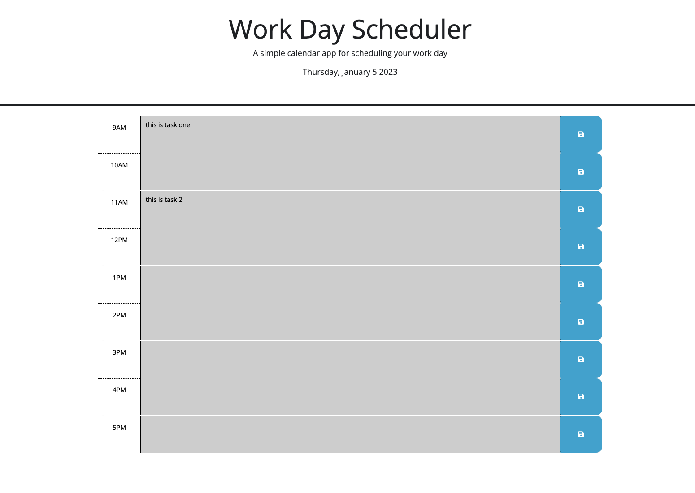

# 05 Third-Party APIs: Work Day Scheduler

In this task I edited the existing files to create a work day scheduler. 

I added the a current day notifier at the top of the page with dayjs. 
I also used dayjs to track the current hour, and used this to change the color of each hour bar as time passed.

Each task in each hour is saved to local storage, and once saved, will appear on the page with every reload unless removed (delete and save again).

Here is an image of the deployed application. 

Here is a link to the deployed application.
https://carsonadair.github.io/challenge-5-work-day-schedule/